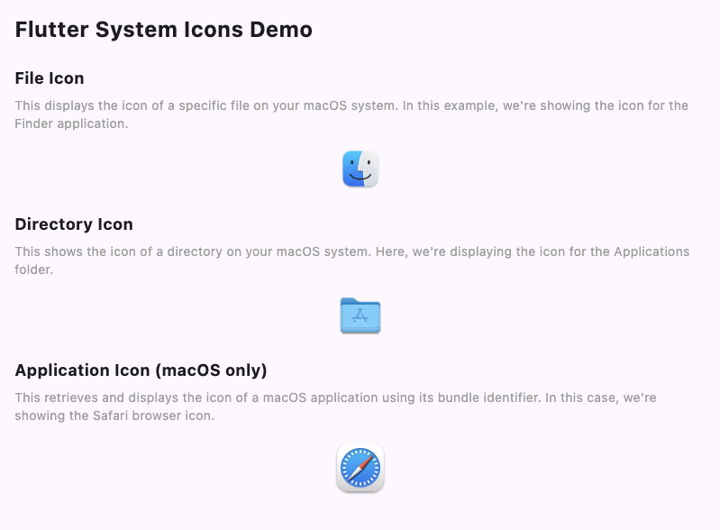

# Flutter System Icons

[](https://pub.dev/packages/flutter_system_icons)
[](LICENSE)

Effortlessly retrieve and display system icons in your Flutter desktop applications.




## 🚀 Features

- 🖼️ Retrieve system icons for files, directories, and applications
- 🖥️ Easy-to-use widgets for displaying system icons
- 🚀 Efficient caching and asynchronous loading
- 🌐 Cross-platform support (currently focused on macOS)

## 🛠️ Installation

Add `flutter_system_icons` to your `pubspec.yaml`:

```yaml
dependencies:
  flutter_system_icons: ^0.1.0
```

Then run:

```bash
flutter pub get
```

## 🔧 Usage

### Import the package

```dart
import 'package:flutter_system_icons/flutter_system_icons.dart';
```

### File Icon

```dart
FileIconWidget(
  filePath: '/path/to/file.txt',
  radius: 16.0,
)
```

### Directory Icon

```dart
DirectoryIconWidget(
  directoryPath: '/path/to/directory',
  radius: 16.0,
)
```

### Application Icon (macOS only)

```dart
BundleIconWidget(
  bundleIdentifier: 'com.apple.finder',
  radius: 16.0,
)
```

### Using the IconService directly

```dart
final iconService = ref.watch(iconServicePOD);
final icon = await iconService.getIconByPath('/path/to/file.txt');

if (icon != null) {
  // Use the icon data
  print('Icon size: ${icon.width}x${icon.height}');
}
```

## 📱 Example

```dart
import 'package:flutter/material.dart';
import 'package:flutter_system_icons/flutter_system_icons.dart';
import 'package:hooks_riverpod/hooks_riverpod.dart';

void main() => runApp(ProviderScope(child: MyApp()));

class MyApp extends StatelessWidget {
  @override
  Widget build(BuildContext context) {
    return MaterialApp(
      home: Scaffold(
        appBar: AppBar(title: Text('Flutter System Icons Demo')),
        body: Center(
          child: Column(
            mainAxisAlignment: MainAxisAlignment.center,
            children: [
              FileIconWidget(
                filePath: '/Users/username/Documents/example.txt',
                radius: 32.0,
              ),
              SizedBox(height: 20),
              DirectoryIconWidget(
                directoryPath: '/Users/username/Documents',
                radius: 32.0,
              ),
              SizedBox(height: 20),
              BundleIconWidget(
                bundleIdentifier: 'com.apple.finder',
                radius: 32.0,
              ),
            ],
          ),
        ),
      ),
    );
  }
}
```

## 💻 Platform Support

| Platform | Support |
|----------|---------|
| macOS    | ✅ Stable |
| Windows  | 🚧 Planned |
| Linux    | 🚧 Planned |

## 🤝 Contributing

We welcome contributions to improve Flutter System Icons, especially for Windows and Linux support. If you encounter any issues or have suggestions, please open an issue on our [GitHub repository](https://github.com/klarity-app/flutter_system_icons).

To contribute:

1. Fork the repository
2. Create your feature branch (`git checkout -b feature/AmazingFeature`)
3. Commit your changes (`git commit -m 'Add some AmazingFeature'`)
4. Push to the branch (`git push origin feature/AmazingFeature`)
5. Open a Pull Request

Please note that all contributions are subject to review and approval by the Klarity team.

## 📄 License

This project is proprietary software owned by Klarity. All rights reserved. See the [LICENSE](LICENSE) file for details.

## 📬 Contact

For any inquiries or support, please contact us at info@klarity.app

---

Made with ❤️ by [Klarity](https://www.klarity.app)
